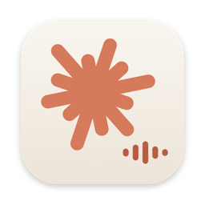

<p align="center"></p>

# Hey Claude

Asistente de voz "hey claude" para macOS que conecta tu micrófono con [Claude Code](https://claude.com/claude-code). Dices **"hey claude"** y le pides cosas: abrir apps o páginas, leer y usar sitios en Chrome, revisar tu correo o calendario, poner recordatorios, crear documentos o simplemente preguntar. Responde con voz, en español o inglés, y muestra un widget flotante estilo Siri con lo que va haciendo.

Todo corre en tu Mac con **tu propia cuenta de Claude**. No hay servidores intermedios ni claves de terceros.

## Qué hace

- **Voz neuronal local (opcional)**: Kokoro-82M (Apache 2.0) corriendo en tu Mac, mucho más natural que las voces de Apple y sin enviar nada fuera. Se instala una vez con `tts/setup_kokoro.sh` (o el botón "Instalar Kokoro…" en Ajustes; descarga PyTorch y el modelo, ~1 GB) y se activa en Ajustes → Voz neuronal. Voces en español e inglés a elegir; si el servidor no responde, la app vuelve sola a la voz de Apple.
- **Mensajes y notificaciones**: "¿qué notificaciones tengo?" lee el Centro de notificaciones; "léeme el último mensaje" o "los últimos 3 mensajes de Ana" leen Mensajes/iMessage (requiere Acceso total al disco para Claude Voice). Sin modelo, al instante.
- **Calendario de Apple**: "busca eventos duplicados en mi calendario y bórralos", "qué tengo el jueves", "crea una cita el lunes a las 10". Usa EventKit (`tareas/calendario`, compilado por build.sh: calendarios, eventos, duplicados y también Recordatorios) y, si falta el permiso, la app Calendario por AppleScript (`tareas/calendario.sh`). La primera vez macOS pide permiso de Calendario para Claude Voice. También puede quitar un calendario o suscripción entera ("borra el calendario de Facebook"), siempre confirmando. Borrar eventos está permitido: si solo pides buscar, te dice cuántos hay y pregunta; con más de 30 resume y confirma.
- **Manos libres para el Mac**, sin pasar por el modelo: "sube el brillo", "volumen al 30", "silencia la Mac", "bloquea la pantalla", "apaga la pantalla", "pon a dormir la Mac", "cierra Safari", "cierra todo menos Chrome", "pausa la música", "siguiente canción", "expulsa los discos", "conecta los AirPods" (con `blueutil`), "activa no molestar" (con un Atajo llamado "No molestar").
- **Ojos**: "¿qué es esto?", "¿qué dice aquí?", "explícame esto" capturan la ventana activa y responden sobre lo que se ve; "esta zona" deja que marques un área con el mouse. "En mi pantalla…" captura la pantalla completa. Requiere permiso de Grabación de pantalla.
- **Historial por voz**: "¿qué me dijiste ayer sobre las facturas?" busca en el historial y te lo lee, con la hora.
- **Rutinas**: "cada mañana a las 8 dime el clima y mi agenda", "todos los lunes a las 9 revisa mi correo". Se ejecutan solas por voz cuando el asistente está libre. "¿Qué rutinas tengo?", "borra la rutina de las 8". También en Ajustes → Memoria y rutinas.
- **Memoria revisable**: Ajustes → Memoria y rutinas lista todo lo que Claude sabe de ti, con fecha y botón de borrar; "¿qué sabes de mí?" lo resume por voz, y una vez por semana te cuenta lo nuevo que aprendió.
- **Widget con estados**: anillo de progreso alrededor del logo mientras corre una tarea (paso n de m), anillo azul latiendo cuando espera tu "sí", y el último hito al pasar el mouse. El panel de tareas muestra una miniatura en vivo de la ventana de Chrome que Claude está usando y una terminal con los comandos que ejecuta y su salida (también para la conversación normal mientras corre comandos).
- **Auriculares**: con AirPods o audífonos se desactiva la cancelación de eco (que resta sensibilidad al micrófono) y se puede interrumpir a Claude hablando normal.
- **Activación por voz** ("hey claude" u "oye claude"), por tecla (⌥⌘C), por clic en el widget o desde Siri con un Atajo. **Silenciar la voz**: botón 🔊 del widget, menú de la barra o diciendo "modo silencio" / "con voz"; Claude sigue escribiendo en el widget pero no habla (útil para no oír narrada toda una tarea). **Esc dos veces** seguidas cancela la orden en curso (mientras escucha, piensa o habla); un Esc solo no hace nada, por si era para otra app.
- **Conversación continua**: tras cada respuesta sigue escuchando unos segundos; puedes interrumpirlo hablando encima, con el botón ■ del widget, o decir "para".
- **Respuesta en streaming**: empieza a leer la primera frase mientras genera el resto, resaltando la palabra que va diciendo.
- **Acciones en la Mac**: abre apps y páginas, ejecuta comandos de consulta (procesos, disco, batería…), crea y edita archivos, usa Chrome mediante la extensión *Claude in Chrome*, y Gmail/Google Calendar si los tienes conectados en Claude Code. Nunca borra archivos ni ejecuta comandos destructivos (lista de exclusión en el código).
- **Recordatorios y temporizadores** locales: "recuérdame en 20 minutos sacar la ropa", "pon un temporizador de 5 minutos", "remind me at 3 pm to call mom".
- **Memoria personal**: "recuerda que mi universidad es X" o datos que salgan en la conversación se guardan en `contexto.md` y se usan en cada orden.
- **Modelos por nivel**: preguntas simples con Haiku, lo demás con Sonnet, y el modelo grande solo si pides "piensa bien". Configurable en Ajustes.
- **Bilingüe**: entiende español e inglés con un solo reconocedor local de Apple, responde en el idioma de la orden y usa una voz distinta para cada idioma.
- **Cancelación de eco**: la voz de Claude sale por el mismo motor de audio que captura el micrófono, así no se oye a sí mismo; pausa lo que esté sonando (YouTube, Spotify) mientras conversas y lo reanuda al terminar.
- **Rápido**: Claude Code se queda abierto en segundo plano recibiendo órdenes en streaming; cada orden tarda 1 o 2 segundos en vez de arrancar desde cero.
- **Respuestas instantáneas sin modelo**: hora, fecha, batería y recordatorios pendientes se contestan en la app, en cero segundos y sin gastar cuota.
- **Ve tu pantalla y tu portapapeles**: "qué dice este error en mi pantalla", "resume lo que copié", "traduce lo seleccionado" (pantalla y selección piden permiso de Grabación de pantalla y Accesibilidad la primera vez).
- **Dictado en cualquier app**: "teclea: hola profesor, le adjunto la tarea" escribe el texto en la ventana activa.
- **Tareas largas en segundo plano**: si dices "en segundo plano", "juega una partida", "investiga a fondo", "haz un informe"…, Claude primero te dice el plan en dos frases y espera tu "adelante". Luego la tarea corre en un proceso propio con herramientas ampliadas (scripts, instalar programas) y tú recuperas el asistente. Solo te lee los hitos importantes, te avisa al terminar con voz y notificación, y puedes preguntar "cómo vas" o decir "cancela la tarea". Mientras una tarea corre, lo que le digas sobre ella ("más rápido", "cambia de estrategia") se le pasa a esa misma tarea, que continúa con toda su memoria; una tarea nueva solo se crea si dices "en segundo plano" u "otra tarea". Si una orden normal pasa de 40 segundos, se convierte sola en tarea de segundo plano. Límite de tiempo por tarea (30 min, o "tómate una hora").
- **Panel de tareas**: un segundo panel sobre el widget con cada tarea, su tiempo, los pasos del plan como línea de tiempo (hechos, en curso, pendientes), el último hito y el resultado. Se muestra u oculta desde el menú.
- **Historial en la app**: ventana con las conversaciones, buscador y botón para retomar una anterior.
- **Widget**: se encoge a un círculo en reposo, se puede arrastrar, tema claro u oscuro, orden escrita con ⌥⌘T para lugares con gente.

## Requisitos

- macOS 14 (Sonoma) o superior, Apple Silicon recomendado.
- Xcode o las Command Line Tools (`xcode-select --install`) para compilar.
- [Claude Code](https://claude.com/claude-code) instalado y con sesión iniciada (`claude`). Funciona con la suscripción Pro o Max; no requiere API key.
- Opcional: extensión [Claude in Chrome](https://claude.com/chrome) para navegar; voces "Mejorada" de Apple para mejor sonido.

## Cuenta de Claude

Hey Claude no tiene inicio de sesión propio: usa la sesión de **Claude Code**, y la cuenta vive ahí. Solo se hace una vez:

1. Instala Claude Code (instrucciones oficiales en [claude.com/claude-code](https://claude.com/claude-code)).
2. Abre Terminal y ejecuta `claude`. La primera vez abre el navegador para iniciar sesión con tu cuenta de Claude (suscripción Pro o Max). Con eso la sesión queda guardada en tu Mac.
3. Ejecuta el instalador de abajo. Comprueba que la sesión exista y, si no, te lo dice.

Cada orden de voz corre con tu cuenta y tu suscripción. La app no guarda credenciales ni necesita API key. Para cambiar de cuenta, vuelve a `claude` y usa `/logout` y luego inicia sesión de nuevo; la app usa la sesión que tenga Claude Code.

## Firma estable (recomendado)

La app se firma ad hoc por defecto, y cada compilación cambia su huella: macOS puede olvidar permisos como Grabación de pantalla. `app/make_identity.sh` crea una vez un certificado propio "Hey Claude Dev" en tu llavero (pide tu contraseña para confiar en él) y desde entonces `build.sh` firma con él y los permisos se conservan. La primera compilación firmada pedirá los permisos una última vez.

## Instalación

Una sola línea (clona donde quieras y ejecuta el instalador; la app guarda sus datos en `~/claude-voice`):

```bash
git clone https://github.com/rafatito2/hey-claude.git ~/Developer/hey-claude && ~/Developer/hey-claude/install.sh
```

El instalador comprueba los requisitos, compila la app, la registra para arrancar al iniciar sesión y la abre. La primera vez macOS pide permiso de **Micrófono** y **Reconocimiento de voz**: acéptalos.

Después:

1. Edita `~/claude-voice/contexto.md` con tus datos (universidad, sitios que usas, nombres). Claude lo lee en cada orden y lo va completando solo.
2. Descarga una voz mejorada: Ajustes del Sistema → Accesibilidad → Contenido hablado → Voz del sistema → Gestionar voces. Elígela en el ícono de la barra → Ajustes.
3. Para activarlo con Siri, crea un Atajo llamado "Claude" con una sola acción *Ejecutar script de shell*: `touch ~/claude-voice/.trigger`. Luego "Oye Siri, Claude".

## Uso

| Dices | Pasa |
|---|---|
| "hey claude, abre YouTube" | Abre Chrome en YouTube |
| "hey claude, revisa si tengo tareas en Canvas" | Navega, lee la página y te resume |
| "hey claude, qué app usa más procesador" | Consulta el sistema y responde |
| "hey claude, qué dice este error en mi pantalla" | Captura la pantalla y la lee |
| "teclea: nos vemos a las cinco" | Escribe el texto en la app activa |
| "recuérdame en 10 minutos tomar agua" | Recordatorio con voz y notificación |
| "recuerda que mi carrera es ingeniería" | Lo guarda en `contexto.md` |
| "nueva conversación" | Empieza de cero |
| "en segundo plano, investiga X y hazme un resumen" | Plan, confirmación y tarea en segundo plano |
| "cómo vas" / "cancela la tarea" | Estado o cancelación de la tarea |
| "gracias, listo" | Cierra la conversación |

Menú de la barra: escuchar ahora, escribir una orden, nueva conversación, uso de hoy (tokens y costo; clic para ver el detalle), historial, contexto, vocabulario, correcciones de dictado (`correcciones.txt`: "lo que oye => lo que quisiste decir", para deformaciones fijas como "chef.com => chess.com") y Ajustes, en pestañas: Voz (Apple y neuronal), Conversación (espera, sonido, modelos por nivel), Widget y atajos, Memoria y rutinas, y Uso (órdenes, tokens y costo de hoy, del mes y total; por modelo y por tipo, incluidas las rutas locales gratis; aviso opcional si el mes pasa de cierto costo; es el precio de lista que reporta Claude Code, con suscripción no se cobra aparte).

## Archivos

| Archivo | Para qué |
|---|---|
| `app/main.swift` | La app (AppKit + Speech + AVFoundation) |
| `app/tasks.swift` | Tareas largas en segundo plano y panel de progreso |
| `app/build.sh` | Compila `ClaudeVoice.app` |
| `~/claude-voice/` | Carpeta de datos de la app: `contexto.md` (memoria personal), `vocabulario.txt`, `modelos.txt`, historial, recordatorios, tareas y la app compilada. No se sube al repo. |
| `vocabulario.txt` | Palabras que el reconocedor debe conocer |
| `modelos.txt` | Modelo por nivel de orden |
| `recordatorios.json`, `voice.log` | Recordatorios pendientes e historial (locales) |
| `ask.sh`, `make_shortcut.py` | Versión mínima por Atajo de Apple + dictado, sin app |

## Privacidad y seguridad

- El reconocimiento de voz es local (Apple, modo en el dispositivo). Solo el texto de tus órdenes viaja a Claude, con tu cuenta.
- La app ejecuta comandos en tu Mac en tu nombre, pero solo de una lista blanca de comandos de consulta y apertura (`allowedTools` en `main.swift`): abrir apps, AppleScript, procesos, disco, batería, listar y leer archivos, crear carpetas y copiar. Solo puede crear o editar archivos en el Escritorio, en Documentos y en su contexto personal. No puede borrar, usar sudo, matar procesos ni enviar correos.
- Cuando le pides ver la pantalla, la captura va a un archivo temporal que se borra al terminar la orden.
- Historial y contexto se guardan en texto plano en `~/claude-voice`. Están en `.gitignore`.
- Para ver trazas de todo lo que oye (solo para depurar): `defaults write com.heyclaude.voice debugTrace -bool true` y reinicia la app.

## Desinstalar

```bash
~/claude-voice/uninstall.sh
```

---

## English

Voice assistant for macOS built on Claude Code. Say "hey claude" and ask it to open apps or sites, browse in Chrome, check mail or calendar, set reminders, create files, or just answer questions. Streams the spoken reply with word highlighting, understands Spanish and English, cancels its own echo, and pauses your media while you talk. Requires macOS 14+, Xcode tools, and Claude Code signed in with your own subscription. Install with `./install.sh`; the UI and prompts are in Spanish but it replies in whichever language you speak.
